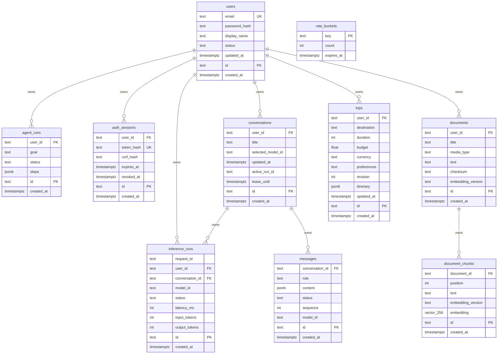

# Implemented entity relationship diagram

```mermaid
erDiagram
    users ||--o{ agent_runs : owns
    users ||--o{ auth_sessions : owns
    users ||--o{ conversations : owns
    users ||--o{ documents : owns
    users ||--o{ trips : owns
    documents ||--o{ document_chunks : owns
    users ||--o{ inference_runs : owns
    conversations ||--o{ inference_runs : owns
    conversations ||--o{ messages : owns
    rate_buckets {
      text key PK
      int count
      timestamptz expires_at
    }
    users {
      text email UK
      text password_hash
      text display_name
      text status
      timestamptz updated_at
      text id PK
      timestamptz created_at
    }
    agent_runs {
      text user_id FK
      text goal
      text status
      jsonb steps
      text id PK
      timestamptz created_at
    }
    auth_sessions {
      text user_id FK
      text token_hash UK
      text csrf_hash
      timestamptz expires_at
      timestamptz revoked_at
      text id PK
      timestamptz created_at
    }
    conversations {
      text user_id FK
      text title
      text selected_model_id
      timestamptz updated_at
      text active_run_id
      timestamptz lease_until
      text id PK
      timestamptz created_at
    }
    documents {
      text user_id FK
      text title
      text media_type
      text text
      text checksum
      text embedding_version
      text id PK
      timestamptz created_at
    }
    trips {
      text user_id FK
      text destination
      int duration
      float budget
      text currency
      text preferences
      int revision
      jsonb itinerary
      timestamptz updated_at
      text id PK
      timestamptz created_at
    }
    document_chunks {
      text document_id FK
      int position
      text text
      text embedding_version
      vector_256 embedding
      text id PK
      timestamptz created_at
    }
    inference_runs {
      text request_id
      text user_id FK
      text conversation_id FK
      text model_id
      text status
      int latency_ms
      int input_tokens
      int output_tokens
      text id PK
      timestamptz created_at
    }
    messages {
      text conversation_id FK
      text role
      jsonb content
      text status
      int sequence
      text model_id
      text id PK
      timestamptz created_at
    }
```

See SCHEMA.md for field constraints/indexes and MIGRATIONS.md for revision history.
